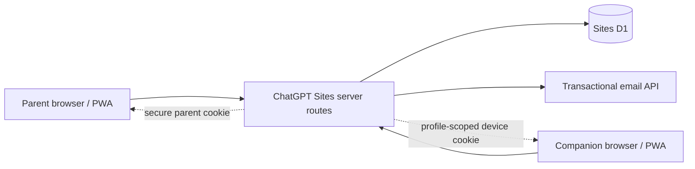

# Ruutin Development Specification

Status: G00–G01 complete; G02 parent TAC authentication next  
Source: supplied “Updated @Sites Build Prompt — Bintang Rumah”; product renamed to **Ruutin**  
Companion tracker: [`../TASKS.md`](../TASKS.md)

## 1. Purpose

Ruutin is a public, mobile-first family routine and reward tracker. Its name is a wordplay on the Bahasa Malaysia word “rutin.” A parent manages the household, profiles, tasks, approvals, stars, rewards, and linked devices. An eligible family member may use a profile-scoped companion device to claim tasks and request rewards.

The product is marketed to parents and caregivers. It must not target children under 13 or below the applicable local age of digital consent. The MVP minimizes child data and gives parents control over consequential actions.

This document is the implementation contract. The source brief remains the product authority; this document translates it into technical decisions, invariants, and verification requirements. Work is tracked in `TASKS.md` by stable task ID.

## 2. Deployment constraint

ChatGPT Sites is the exclusive build, runtime, hosting, saved-preview, and public-deployment target. Do not introduce or document a fallback host such as Vercel, Cloudflare Pages, Netlify, or a self-hosted runtime.

Platform-dependent behavior must be tested in ChatGPT Sites itself. If Sites cannot securely call the chosen transactional email API from server-side code, stop and report the incompatibility; do not move authentication or deployment elsewhere and do not substitute Sign in with ChatGPT. Lack of service-worker support is the sole defined graceful degradation: retain the manifest, icons, standalone metadata, and install guidance without offline caching.

## 3. Product principles and non-negotiable rules

1. **Parent control:** only a parent may configure profiles, tasks, star values, rewards, approvals, and device access.
2. **Data minimization:** a profile contains only a parent-selected nickname, emoji, optional broad age band, eligibility state, and application settings.
3. **No independent access below the applicable threshold:** parents can manage and record completions, but a companion session cannot be created for an ineligible profile.
4. **Server authority:** all authentication, authorization, validation, and mutations run on Sites server routes. Browser-supplied household or profile identifiers are never authorization evidence.
5. **Ledger integrity:** the append-only point ledger is the source of truth. Every award or deduction is idempotent and attributable.
6. **Private-by-default caching:** authenticated HTML and private API responses are never stored in service-worker caches.
7. **Neutral authentication responses:** TAC endpoints do not reveal whether an email is registered.
8. **No deployment shortcuts:** email delivery, authorization, pairing/revocation, migrations, and published Sites PWA behavior must be verified before public deployment.

### Prohibited child data

- Email addresses or phone numbers
- Full legal names or exact dates of birth
- School names or locations
- Photographs or voice recordings
- Open-ended biographies

### Explicitly out of scope

- Passwords, child email authentication, and Sign in with ChatGPT
- R2, uploads, payments, AI calls, external analytics SDKs, and push notifications
- WebSockets, background synchronization queues, calendar synchronization, location triggers, timers, reminders, task dependencies, and complex recurrence expressions
- Cash, banking, gift cards, purchases, negative points for missed tasks, streak penalties, loot boxes, leaderboards, and sibling rankings
- Caregiver invitations in the UI, despite a schema that can support multiple household users later
- Required offline operation
- Any non-Sites deployment configuration or hosting adapter

## 4. MVP actors and permission boundaries

| Capability | Unauthenticated visitor | Parent session | Companion session |
| --- | --- | --- | --- |
| View public/auth pages | Yes | Yes | Pairing entry only |
| Manage household and profiles | No | Own household | No |
| Manage tasks and star values | No | Own household | No |
| Submit completion | No | Direct parent completion | Assigned profile only |
| Approve/reject claims | No | Own household | No |
| View stars and rewards | No | Own household | Assigned profile only |
| Request reward | No | May manage requests | Assigned profile only |
| Approve/reject redemption | No | Own household | No |
| Link/revoke devices | No | Eligible profiles in own household | No |
| Read parent email or sibling data | No | Own account/household | Never |
| Export/delete household | No | Own household after required checks | No |

The companion authorization context is the device record and its assigned profile. A route must not broaden that scope based on a profile ID supplied in a URL, form, or JSON body.

## 5. Sites architecture



### Required components

- ChatGPT Sites build, server routes, saved versions, hosting, and deployment
- D1 for all durable structured application data
- Server-side routes for authentication, authorization, reads, and mutations
- Transactional email API for parent TAC delivery
- Sites-hosted secrets/environment variables
- Secure, opaque cookie sessions
- Static, version-controlled task and reward templates

### Mandatory Sites runtime preflight gates

These are the first implementation tasks and produce written evidence in `docs/evidence/`.

1. **Server-side email gate:** prove that a Sites server route can securely call the selected transactional email API using hosted secrets. If unavailable, stop. Do not substitute another host or Sign in with ChatGPT.
2. **D1 gate:** prove the supported Sites binding and migration workflow locally and in a saved Sites version.
3. **Service-worker gate:** verify service-worker support on a saved/published Sites origin. If unsupported, retain the manifest, icons, standalone metadata, and install guidance but omit offline caching.

The repository uses the Sites-generated vinext/Vite framework and emits a
Cloudflare Worker-compatible ESM bundle. The canonical local commands are:

```text
npm ci                 # install the lockfile exactly
npm run dev            # retained local Sites preview
npm run format:check   # dependency-free LF/trailing-whitespace check
npm run lint           # ESLint + React/Next accessibility rules
npm run typecheck      # TypeScript, no emit
npm test               # build + server-rendered landing-page tests
npm run build          # deployment bundle verification
npm run scan:secrets   # server-only/client-bundle boundary check
npm run quality        # all baseline checks in sequence
```

The public route is a server-rendered parent-focused landing/auth entry. It
does not import server configuration and does not require local credentials.
The temporary starter `SkeletonPreview`, its `codex-preview` marker, and its
`react-loading-skeleton` dependency are removed from the finished slice.

The project keeps the Sites binding declaration in `.openai/hosting.json` and
the local simulation in `vite.config.ts`; no alternate-host adapter or
configuration is permitted.

## 6. Configuration and secrets

Required Sites-hosted variables:

| Name | Secret | Browser-visible | Purpose |
| --- | --- | --- | --- |
| `EMAIL_API_URL` | Usually no | No | Transactional email endpoint |
| `EMAIL_API_KEY` | Yes | Never | Transactional email credential |
| `EMAIL_FROM` | No | No | Verified sender address |
| `AUTH_HMAC_SECRET` | Yes | Never | Protect TAC and pairing-code verification material |
| `SESSION_SECRET` | Yes | Never | Server-only session cryptography |

Production must fail closed when required configuration is missing. No secret or derivative that enables authentication may appear in client bundles, HTML, logs, exports, or error responses.

The typed boundary is `server/runtime-config.ts` plus the Sites runtime adapter
in `server/config.ts`. `loadServerConfig` validates non-empty values, the
email API URL, and the sender address without returning secret values in an
error. `getServerConfig` uses strict validation for every future server route;
the public landing page deliberately never resolves it. `scripts/scan-secrets.mjs`
checks that `app/` does not import the boundary and that configured values do
not appear in `dist/`.

## 7. Data conventions

- Use random, non-sequential IDs suitable for untrusted URLs.
- Store server timestamps in UTC using one canonical representation.
- Store an IANA timezone on each household; derive `local_date` and due dates from it on the server.
- Normalize email consistently before lookup, hashing, and rate limiting. Preserve `email` for display/delivery and make `email_normalized` unique.
- Store schedule data in a documented, validated JSON shape.
- Use D1 transactions for state changes that combine a status transition with a ledger entry.
- Use database uniqueness constraints as the final idempotency guard; application checks improve errors but do not replace constraints.
- Never use a mutable balance column as the source of truth. Balance is `SUM(point_ledger.stars_delta)` for the profile.

### Schedule representation

Only these schedule types are valid:

```ts
type TaskSchedule =
  | { type: "daily" }
  | { type: "weekdays"; days: Array<1 | 2 | 3 | 4 | 5 | 6 | 7> }
  | { type: "one_off"; localDate: string }; // YYYY-MM-DD
```

Weekday numbering must be defined once and shared by server validation and UI labels. A task occurrence is identified by `(task_id, child_profile_id, due_date)`, where `due_date` is the household-local calendar date.

## 8. D1 schema and invariants

Create versioned, reviewable migrations using the Sites-supported D1 workflow. Make all foreign-key behavior and indexes explicit.

| Table | Required fields | Critical constraints |
| --- | --- | --- |
| `users` | `id`, `email`, `email_normalized`, `created_at`, `last_login_at` | Unique `email_normalized` |
| `households` | `id`, `name`, `timezone`, `created_at` | Valid IANA timezone at application boundary |
| `household_users` | `household_id`, `user_id`, `role`, `created_at` | Unique `(household_id, user_id)`; role allowlist |
| `auth_challenges` | `id`, `email_normalized`, `code_hash`, `purpose`, `expires_at`, `attempt_count`, `consumed_at`, `created_at` | No plaintext TAC; indexes for active lookup/rate limiting |
| `sessions` | `id`, `user_id`, `token_hash`, `expires_at`, `revoked_at`, `created_at`, `last_seen_at` | Unique `token_hash`; never store raw token |
| `child_profiles` | `id`, `household_id`, `nickname`, `emoji`, `age_band`, `companion_access_eligible`, `active_reward_id`, `archived_at`, `created_at` | Active reward belongs to same profile; broad age-band allowlist |
| `tasks` | `id`, `household_id`, `child_profile_id`, `title`, `emoji`, `stars`, `schedule_type`, `schedule_data`, `position`, `archived_at`, `created_at`, `updated_at` | Stars in `1..3`; profile belongs to household |
| `task_claims` | `id`, `household_id`, `child_profile_id`, `task_id`, `due_date`, `submitted_by_type`, `submitted_by_device_id`, `status`, `submitted_at`, `resolved_at`, `resolved_by_user_id` | Valid states/submitters; prevent duplicate approved completion per occurrence |
| `point_ledger` | `id`, `household_id`, `child_profile_id`, `event_type`, `stars_delta`, `source_type`, `source_id`, `reason`, `actor_user_id`, `local_date`, `created_at` | Append-only; unique source event |
| `rewards` | `id`, `household_id`, `child_profile_id`, `title`, `emoji`, `star_cost`, `archived_at`, `created_at`, `updated_at` | Positive cost; no more than five active per profile |
| `reward_requests` | `id`, `household_id`, `child_profile_id`, `reward_id`, `status`, `requested_by_device_id`, `requested_at`, `resolved_at`, `resolved_by_user_id` | Valid state; idempotent resolution |
| `pairing_codes` | `id`, `household_id`, `child_profile_id`, `code_hash`, `token_hash`, `expires_at`, `attempt_count`, `consumed_at`, `cancelled_at`, `created_by_user_id`, `created_at` | No plaintext code/token; single use |
| `child_devices` | `id`, `household_id`, `child_profile_id`, `device_label`, `token_hash`, `created_at`, `last_seen_at`, `revoked_at` | Unique `token_hash`; immutable assigned profile |

Required indexes include session/device token hashes, active challenge expiry lookups, household/profile foreign keys, due-date claim queries, pending parent queues, ledger profile/date queries, and active reward/request queries.

### State machines

```text
TAC:             active -> consumed | expired | locked
Pairing code:    active -> consumed | cancelled | expired | locked
Task claim:      pending -> approved | rejected
Reward request:  pending -> approved | rejected
Session/device:  active -> revoked | expired
```

Only a transition from `pending` may create a ledger event. A repeated approval receives an idempotent success or a conflict but never creates a second ledger row.

## 9. Authentication and parent sessions

### Email TAC request

1. Normalize and validate the parent email.
2. Apply rate limits by normalized email and request source.
3. Generate a cryptographically secure six-digit code.
4. Store only an HMAC/protected hash with purpose, ten-minute expiry, and zero attempts.
5. Invalidate previous active TACs for the same email and purpose.
6. Send through the configured email API from a Sites server route.
7. Return the same neutral response regardless of account existence.

### TAC verification

1. Resolve the newest active challenge server-side.
2. Reject expired, consumed, or locked challenges with a generic error.
3. Compare protected values safely; increment failed attempts atomically.
4. Block after five failed attempts.
5. On success, consume the challenge atomically, create the user if needed, update last login, and create a session.
6. Rotate/replace any pre-authentication session state.

### Parent session

- Generate a long cryptographically random opaque token.
- Store only its hash in D1.
- Set it in a `Secure`, `HttpOnly`, `SameSite` cookie with an approximately 30-day expiry and narrow scope.
- Resolve, expiry-check, and revocation-check it on every protected request.
- Support explicit sign-out and server-side revocation.
- Throttle `last_seen_at` writes rather than writing on every request.

State-changing routes also need CSRF protection appropriate to the Sites-generated framework and cookie policy, plus origin checks where supported.

## 10. Household onboarding and profile privacy

First login launches a setup flow intended to finish in under three minutes:

1. Create household and choose timezone.
2. Add the first profile using nickname, emoji, and optional broad age band only.
3. Select routine categories and suggested tasks.
4. Review schedules and one-to-three-star values.
5. Select or create rewards.
6. Optionally pair an eligible companion device.

The MVP exposes one household per parent and one parent account in the UI, while `household_users` remains extensible. The parent must explicitly confirm that the intended companion user meets the applicable age requirement. The server persists and checks `companion_access_eligible`; hiding a button is insufficient.

The digital-consent threshold and age-band copy are launch-policy inputs, not assumptions to hard-code silently. Record the chosen policy before companion access is enabled publicly.

## 11. Template-first task setup

The first task experience is a category/template picker, not a blank form. Static version-controlled application data contains:

- Morning routine
- School preparation
- Homework and reading
- Personal care
- Helping at home
- Bedroom and belongings
- Bedtime routine
- Weekend responsibilities

The initial dataset must include every starter task and default schedule/star value in the source brief. Templates are copied into editable household tasks when selected; they are not D1 template records.

### Required starter template data

**Morning routine**

- Make the bed — weekdays — 1 star
- Brush teeth — daily — 1 star
- Get dressed — weekdays — 1 star
- Pack water bottle — weekdays — 1 star
- Be ready by the agreed time — weekdays — 2 stars

**School preparation**

- Pack school bag — weekdays — 1 star
- Check tomorrow’s timetable — weekdays — 1 star
- Prepare school clothes — weekdays — 1 star
- Put completed work in the bag — weekdays — 2 stars

**Homework and reading**

- Finish assigned homework — weekdays — 2 stars
- Read for 15 minutes — daily — 2 stars
- Review today’s lesson — weekdays — 2 stars
- Put books away after studying — weekdays — 1 star

**Helping at home**

- Clear plate after eating — daily — 1 star
- Put clothes in the laundry basket — daily — 1 star
- Help set or clear the table — parent-selected days — 2 stars
- Help fold laundry — parent-selected days — 2 stars
- Take out household rubbish — parent-selected days — 2 stars

**Bedroom and belongings**

- Put belongings away — daily — 1 star
- Put dirty clothes in the basket — daily — 1 star
- Clear the study table — daily — 1 star
- Tidy the bedroom — weekend — 3 stars

**Bedtime routine**

- Shower and brush teeth — daily — 1 star
- Prepare clothes for tomorrow — weekdays — 1 star
- Put devices away at the agreed time — daily — 2 stars
- Be in bed by the agreed time — daily — 2 stars

`Personal care` and `Weekend responsibilities` are required categories even though the supplied brief defines no additional starter rows for them. “Weekend” and “parent-selected days” must compile to the supported selected-weekdays schedule; they are not new recurrence types.

Parents can select/deselect suggestions, edit wording, change supported schedules, choose one to three stars, add custom tasks, archive, and reorder. Reordering is scoped to one profile and uses deterministic positions.

## 12. Companion pairing and devices

Pairing is available only for a parent-owned eligible profile.

### Challenge creation

- Generate an unpredictable six-digit manual code and a separate high-entropy URL token.
- Store only protected hashes.
- Expire both after ten minutes; the client countdown is advisory and the server is authoritative.
- Limit verification to five attempts per browser/request source and track challenge attempts.
- Allow parent cancellation and replacement; consumed/cancelled/expired codes can never be reused.

### Confirmation and device session

1. `/pair` accepts a manual code or QR/pairing URL.
2. The server verifies the challenge without exposing unrelated profile data.
3. Show only the assigned nickname and emoji and ask for confirmation.
4. Consume the challenge and create a long random device session in one transaction.
5. Store only its hash and send the raw token in a `Secure`, `HttpOnly` cookie.
6. Redirect to companion Today and show home-screen installation guidance.

The session is permanently scoped to one profile. Every request checks revocation. Revocation takes effect on the next request, independent of client-side logout or cached UI.

Parent device management shows label, profile, linked date, last active time, and revocation state. Parents can rename, revoke, and create a replacement pairing challenge.

## 13. Task completion and point ledger

Companion task states are **To do**, **Waiting for approval**, and **Completed**.

Submitting a task opens a confirmation dialog explaining parent review, creates at most one active claim for the occurrence, and returns the pending state. Rejection permits a later claim when the occurrence is still appropriate.

Parent Today shows nickname/emoji, task, stars, submitted time, and approve/reject actions. Approval runs in one server transaction:

1. Resolve the parent and household membership.
2. Select the household-scoped pending claim.
3. Transition it to approved.
4. Insert exactly one `task_approved` ledger row using a unique source key.
5. Return the ledger-derived balance.

Parent direct completion follows the same idempotency standard and creates one `parent_completed_task` event per occurrence. Reversal creates a compensating `task_reversed` entry; history is not rewritten.

Allowed ledger event types are `task_approved`, `parent_completed_task`, `task_reversed`, `reward_redeemed`, and `manual_adjustment`. Every row includes household, profile, delta, source, server timestamp, and household-local date, plus actor/reason where relevant.

## 14. Rewards and redemption

Parents may maintain up to five active rewards per profile, archive rewards, and choose one active goal. The version-controlled suggestions are:

- Choose the family movie — 10 stars
- Choose dessert — 10 stars
- Extra leisure time — 20 stars
- Choose a weekend activity — 30 stars
- Special family outing — 50 stars

Companion screens show balance, active reward, progress, remaining stars, other rewards, request status, and prior approved redemptions.

Reward approval is one server transaction that verifies parent ownership, pending state, and sufficient ledger-derived balance; inserts exactly one negative `reward_redeemed` row; and marks the request approved. Concurrent or repeated requests must not make the balance negative or deduct twice. Rejection changes only request state.

## 15. Route and navigation map

Names may adapt to Sites-generated framework conventions, but capability boundaries remain distinct.

### Public/authentication

- `GET /` — parent-focused public entry
- `GET|POST /auth/request` — request TAC
- `GET|POST /auth/verify` — verify TAC and establish parent session
- `POST /auth/sign-out` — revoke current parent session
- `GET|POST /pair` — validate pairing challenge and confirm profile

### Parent application

- `/app/today` — progress, balances, pending claims and rewards
- `/app/family` — profiles, tasks, schedules, devices, pairing
- `/app/rewards` — catalogue, active goals, requests, history
- `/app/settings` — email, timezone, privacy, export, deletion, sign-out

Parent bottom navigation has exactly Today, Family, Rewards, and Settings.

### Companion application

- `/companion/today` — assigned profile summary and due tasks
- `/companion/rewards` — assigned profile rewards and requests

Companion navigation has exactly Today and Rewards. Parent and companion middleware must be separate. A companion cannot call a parent endpoint even if it guesses valid identifiers.

## 16. UI and interaction requirements

- White or very light base with a soft purple accent
- Joyful, playful, and practical UI: reassuring for parents and especially
  cheerful for companions, without becoming game-like or distracting
- Rounded cards, large readable type, large touch targets, clear icons and progress bars
- Accessible contrast, visible focus states, semantic labels, keyboard support, reduced motion
- Responsive from 360 px through desktop with no horizontal overflow
- Safe-area inset support for installed mobile views
- Purposeful micro-animation makes interactions feel pleasurable: quick press,
  completion, approval, progress, navigation, and success feedback should
  confirm state and reward attention without delaying work
- Motion must use transform/opacity where practical, remain brief and
  interruptible, avoid layout shifts, and fully honor `prefers-reduced-motion`
- No gambling, loot-box, virtual-currency-shop, public-social, or preschool-game treatment
- Do not reproduce the reference screenshot’s subscription paywall

## 17. Synchronization and PWA behavior

The app is online-first. After successful mutations, refetch authoritative data. Also refetch on foreground return and expose manual/pull-to-refresh. Low-frequency refresh is allowed only while the parent approval screen is visible. Do not use WebSockets or a background queue.

Required assets and metadata:

- `manifest.webmanifest`: name **Ruutin**, short name **Ruutin**, standalone display, theme/background colors
- 192×192, 512×512, maskable, and Apple touch icons
- Mobile viewport and safe-area metadata
- Standalone-mode detection
- Post-pairing message: “Save Ruutin to this device’s home screen for easier access.”
- Guidance for Safari on iPhone and common Android browsers

If the Sites gate confirms service-worker support, cache only immutable static assets. Never cache authenticated HTML, private API data, TAC/pairing responses, or mutations. A stale worker must not preserve access after revocation. If unsupported, ship install metadata/guidance without offline behavior.

## 18. Data export and deletion

Export JSON includes household settings, profiles, tasks, claims, rewards, reward requests, ledger rows, and linked-device metadata without session tokens.

It excludes TAC hashes, session/device token hashes, pairing hashes, secrets, and internal authentication material. The response is household-scoped with private/no-store headers.

Deletion requires recent reauthentication or a fresh TAC, strong confirmation, and permanent-deletion copy. Delete according to reviewed foreign-key behavior and revoke all parent and companion sessions in the operation.

## 19. Security and privacy verification

Every protected handler:

1. Resolves the server-side session from its cookie.
2. Checks expiry and revocation.
3. Establishes household/profile scope from the session record.
4. Validates input and business rules.
5. Includes established scope in the database predicate.
6. Returns only fields needed by the current interface.

Required defenses include cross-household and sibling isolation tests, CSRF/origin protection, rate limiting, generic auth/pairing errors, secure headers, output encoding, transaction/idempotency tests, secret scanning, private caching, and sanitized logs without codes, tokens, parent email where avoidable, or child profile details.

No external analytics SDK is permitted. First-party operational logs, if Sites supports them, contain only coarse result identifiers needed to diagnose delivery, rate limiting, authorization denials, and transaction failures.

## 20. Testing strategy

- **Unit:** normalization, protected-code comparison, schedules, timezone boundaries, eligibility, validation, balance/progress.
- **D1/integration:** migrations, foreign keys, uniqueness, state transitions, concurrent/idempotent approval, non-negative redemption, revocation.
- **Route authorization:** unauthenticated, wrong role, cross-household, sibling/profile injection, revoked/expired sessions.
- **End-to-end:** TAC, onboarding, templates, pairing, claims, approvals, redemption, export/deletion, second-device persistence.
- **UI/accessibility:** 360 px, touch targets, keyboard/focus, contrast, reduced motion, safe areas.
- **Saved Sites version/origin:** email API, cookie behavior, manifest/icons, service worker, foreground refresh, secret/client-bundle audit.

The 30 source acceptance cases are mirrored in the release gate in `TASKS.md`. A feature is not complete solely because its happy path renders.

## 21. Delivery, evidence, and delegation

Work in goal-sized batches listed in `TASKS.md`:

1. Set one bounded goal.
2. Delegate only listed task IDs and affected paths.
3. Require the coding agent to inspect current files, preserve unrelated changes, implement, test, and report exact files/results.
4. Use Luna **xhigh** for bounded UI/CRUD/test batches and Luna **max** for authentication, authorization, cryptography, schema/idempotency, pairing, ledger, deletion, and release-security work.
5. Review the diff and rerun relevant checks before marking tasks complete.
6. Save runtime/release evidence under `docs/evidence/`.

## 22. Decisions required before public release

| Decision | Owner | Status | Blocks | Evidence |
| --- | --- | --- | --- | --- |
| Sites-generated project/framework and supported server APIs | Engineering | Resolved | Implementation | Scaffold and saved-version smoke test |
| Resend transactional email credentials, verified sender, and secure Sites server-side reachability | Engineering | Reachability resolved; production credential/sender pending | Parent auth | `docs/evidence/BR-002-email.md` |
| Applicable age-of-digital-consent policy and age-band copy | Product/legal | Pending before pairing release | Pairing | Written policy and UI/server tests |
| Service-worker support on saved/published Sites origin | Engineering | Resolved | Optional caching | `docs/evidence/BR-004-service-worker.md` |
| Timezone defaults and household naming copy | Product | Pending before onboarding release | Onboarding | Approved copy/defaults |
| Retention/deletion semantics and statutory wording | Product/legal | Pending before public release | Public launch | Reviewed copy and deletion test |
| Sites custom domain `ruutin.irwan.cc` | Engineering | Attached; DNS/SSL validation pending | Public launch | `docs/evidence/SITES-custom-domain.md` |

If the email gate fails, implementation pauses at that incompatibility. If the service-worker gate fails, development continues without offline caching. Neither result authorizes a non-Sites deployment.

## 23. Definition of done

A task is complete only when implementation, tests, documentation, and required evidence are present; relevant checks pass; no unrelated changes are included; and its tracker checkbox is updated. The MVP is ready for a saved, reviewable Sites version only after release-blocking tracker items pass. Public deployment is a separate, explicitly authorized Sites action.
